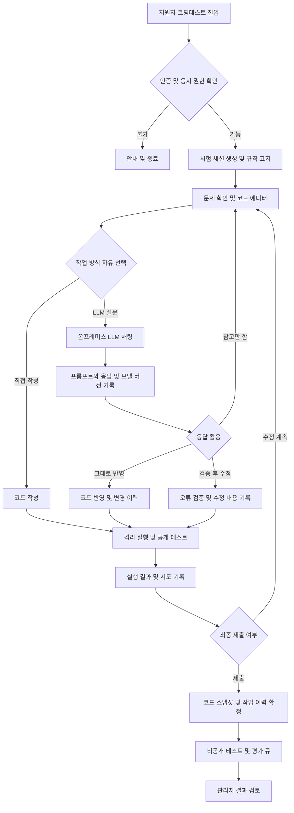
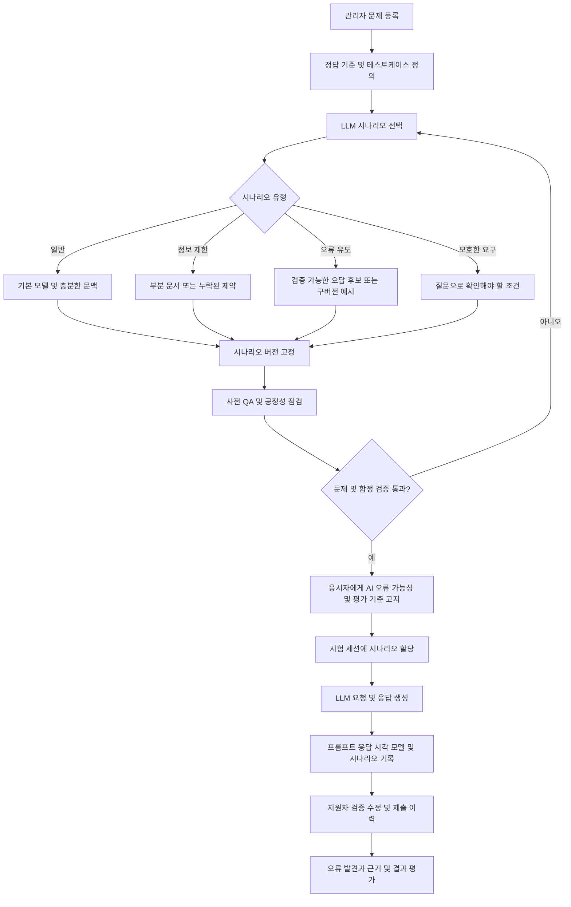
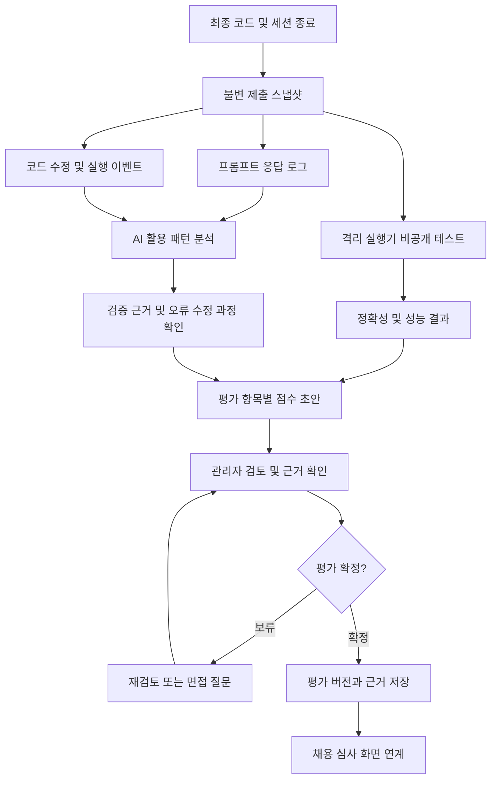
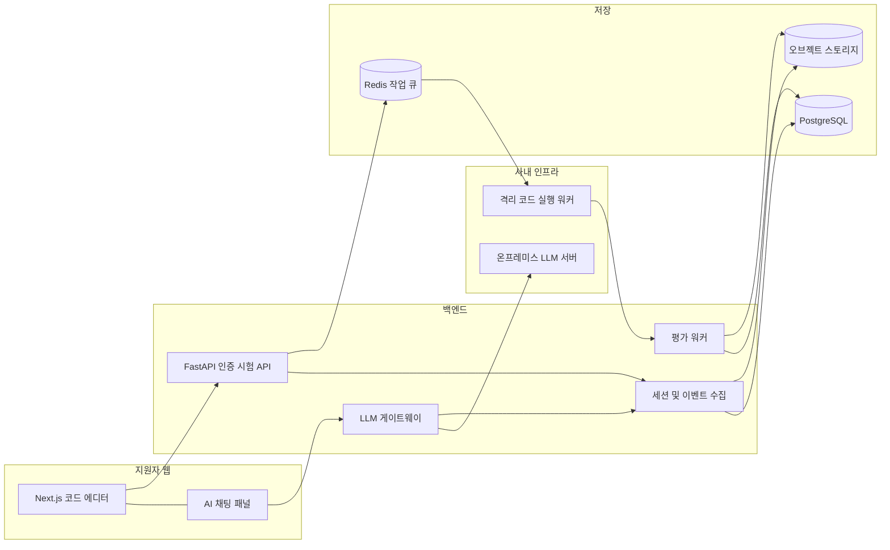
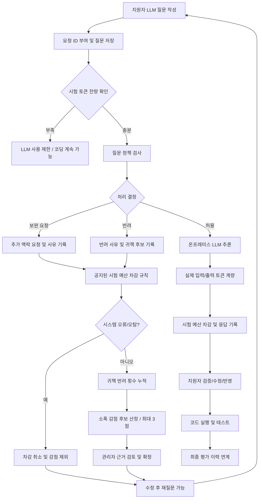

# 코딩테스트 Mermaid 플로우 v0.6

## 09_코딩테스트_지원자플로우.mmd

```mermaid
flowchart TD
 A[지원자 코딩테스트 진입] --> B{인증 및 응시 권한 확인}
 B -->|불가| BX[안내 및 종료]
 B -->|가능| C[시험 세션 생성 및 규칙 고지]
 C --> D[문제 확인 및 코드 에디터]
 D --> E{작업 방식 자유 선택}
 E -->|직접 작성| F[코드 작성]
 E -->|LLM 질문| G[온프레미스 LLM 채팅]
 G --> H[프롬프트와 응답 및 모델 버전 기록]
 H --> I{응답 활용}
 I -->|참고만 함| D
 I -->|그대로 반영| J[코드 반영 및 변경 이력]
 I -->|검증 후 수정| K[오류 검증 및 수정 내용 기록]
 F --> L[격리 실행 및 공개 테스트]
 J --> L
 K --> L
 L --> M[실행 결과 및 시도 기록]
 M --> N{최종 제출 여부}
 N -->|수정 계속| D
 N -->|제출| O[코드 스냅샷 및 작업 이력 확정]
 O --> P[비공개 테스트 및 평가 큐]
 P --> Q[관리자 결과 검토]
```

## 10_온프레미스_LLM_함정_설계.mmd

```mermaid
flowchart TD
 A[관리자 문제 등록] --> B[정답 기준 및 테스트케이스 정의]
 B --> C[LLM 시나리오 선택]
 C --> D{시나리오 유형}
 D -->|일반| E[기본 모델 및 충분한 문맥]
 D -->|정보 제한| F[부분 문서 또는 누락된 제약]
 D -->|오류 유도| G[검증 가능한 오답 후보 또는 구버전 예시]
 D -->|모호한 요구| H[질문으로 확인해야 할 조건]
 E --> I[시나리오 버전 고정]
 F --> I
 G --> I
 H --> I
 I --> J[사전 QA 및 공정성 점검]
 J --> K{문제 및 함정 검증 통과?}
 K -->|아니오| C
 K -->|예| L[응시자에게 AI 오류 가능성 및 평가 기준 고지]
 L --> M[시험 세션에 시나리오 할당]
 M --> N[LLM 요청 및 응답 생성]
 N --> O[프롬프트 응답 시각 모델 및 시나리오 기록]
 O --> P[지원자 검증 수정 및 제출 이력]
 P --> Q[오류 발견과 근거 및 결과 평가]
```

## 11_코딩테스트_평가_및_이력.mmd

```mermaid
flowchart TD
 A[최종 코드 및 세션 종료] --> B[불변 제출 스냅샷]
 B --> C[격리 실행기 비공개 테스트]
 C --> D[정확성 및 성능 결과]
 B --> E[프롬프트 응답 로그]
 B --> F[코드 수정 및 실행 이벤트]
 E --> G[AI 활용 패턴 분석]
 F --> G
 G --> H[검증 근거 및 오류 수정 과정 확인]
 D --> I[평가 항목별 점수 초안]
 H --> I
 I --> J[관리자 검토 및 근거 확인]
 J --> K{평가 확정?}
 K -->|보류| L[재검토 또는 면접 질문]
 L --> J
 K -->|확정| M[평가 버전과 근거 저장]
 M --> N[채용 심사 화면 연계]
```

## 12_코딩테스트_서비스아키텍처.mmd

```mermaid
flowchart LR
 subgraph UI[지원자 웹]
 A[Next.js 코드 에디터] --- B[AI 채팅 패널]
 end
 subgraph API[백엔드]
 C[FastAPI 인증 시험 API]
 D[세션 및 이벤트 수집]
 E[LLM 게이트웨이]
 F[평가 워커]
 end
 subgraph ONPREM[사내 인프라]
 G[온프레미스 LLM 서버]
 H[격리 코드 실행 워커]
 end
 subgraph DATA[저장]
 I[(PostgreSQL)]
 J[(오브젝트 스토리지)]
 K[(Redis 작업 큐)]
 end
 A --> C
 B --> E
 C --> D
 E --> G
 E --> D
 D --> I
 D --> J
 C --> K
 K --> H
 H --> F
 F --> I
 F --> J
```

## 13_LLM_질문반려_토큰예산_감점.mmd

```mermaid
flowchart TD
 A[지원자 LLM 질문 작성] --> B[요청 ID 부여 및 질문 저장]
 B --> C{시험 토큰 잔량 확인}
 C -->|부족| C1[LLM 사용 제한 / 코딩 계속 가능]
 C -->|충분| D[질문 정책 검사]
 D --> E{처리 결정}
 E -->|허용| F[온프레미스 LLM 추론]
 F --> G[실제 입력/출력 토큰 계량]
 G --> H[시험 예산 차감 및 응답 기록]
 H --> I[지원자 검증/수정/반영]
 E -->|보완 요청| J[추가 맥락 요청 및 사유 기록]
 E -->|반려| K[반려 사유 및 귀책 후보 기록]
 J --> L[공지된 시험 예산 차감 규칙]
 K --> L
 L --> M{시스템 오류/오탐?}
 M -->|예| N[차감 취소 및 감점 제외]
 M -->|아니오| O[귀책 반려 횟수 누적]
 O --> P[소폭 감점 후보 산정 / 최대 3점]
 P --> Q[관리자 근거 검토 및 확정]
 N --> R[수정 후 재질문 가능]
 I --> S[코드 실행 및 테스트]
 Q --> R
 R --> A
 S --> T[최종 평가 이력 연계]
```
