# 활동 다이어그램 (UML Activity Diagram)

AI 1차 채용면접 플랫폼의 기능별 동작 흐름을 UML 활동 다이어그램으로 정리한 문서다.
현재 구현 코드(`huge/`, 2026-11-11 기준)를 보고 그렸다. 설계 문서와 다른 부분은 `huge/CONFLICTS.md` 를 따른다.

## 읽는 법

| 기호 | 뜻 |
|---|---|
| ● 검은 원 | 시작 |
| ◉ 테두리 있는 원 | 활동 끝 (전체 흐름 종료) |
| ⊗ X 표시 원 | 흐름 끝 (이 갈래만 끝남) |
| 둥근 사각형 | 행동 |
| ◇ 마름모 | 판단(갈림) 또는 합류. `[조건]` 은 그 길로 가는 조건 |
| 굵은 가로 막대 | 분기(fork): 아래 흐름들이 동시에 진행 |
| 모래시계 | 시간 이벤트 |
| 접힌 종이 | 메모 |
| 세로 칸(swimlane) | 그 행동을 맡은 쪽 |

PNG 는 보기용이다. 아래 Mermaid 코드는 편집용이며, 같은 흐름을 담지만 칸 배치와 모양은 PNG 와 다르게 그려진다.

## 목록

| 번호 | 다이어그램 | 맡은 쪽(칸) |
|---|---|---|
| 01 | 로그인 | 사용자 · 프론트엔드 · 백엔드 API · DB |
| 02 | 지원서 작성 (지원 → 동의 → 이력서 제출) | 지원자 · 프론트엔드 · 백엔드 API · 백그라운드 작업 · DB |
| 03 | 면접 질문 생성 (질문 구성 그래프) | 백그라운드 작업 · AI 서비스 · DB·파일 저장소 |
| 04 | AI 면접 진행 | 지원자 · 프론트엔드 · 백엔드/면접 엔진 · AI 서비스 · DB |
| 05 | 화면 이탈 처리 | 지원자 · 프론트엔드 · 면접 엔진 · DB |
| 06 | 연결 끊김 처리와 이어가기 | 지원자 · 프론트엔드 · 면접 엔진/백엔드 API · DB |
| 07 | 코딩테스트 | 지원자 · 프론트엔드 · 백엔드 API · 격리 실행 환경 · DB |
| 08 | 채점과 결과 공개 | 백그라운드 워커 · AI 서비스 · DB · 관리자 · 지원자 |
| 09 | 관리자 공고 작성·게시 | 관리자 · 프론트엔드 · 백엔드 API · 백그라운드 작업/AI · DB |

## 01. 로그인

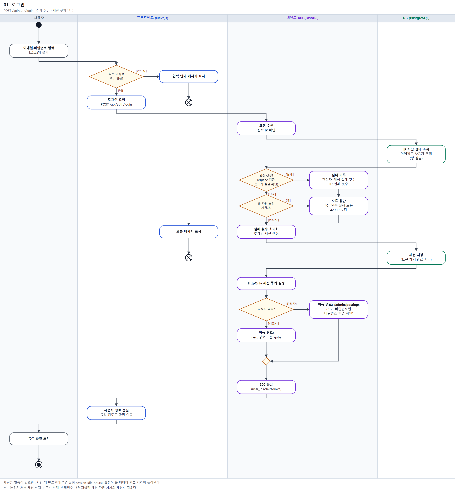

- 입력값이 비면 서버에 보내지 않는다.
- 인증 실패는 관리자 계정 실패 횟수와 IP 실패 횟수로 따로 센다. IP 차단 중이면 429 를 돌려준다.
- 성공하면 세션을 DB 에 저장하고 HttpOnly 쿠키를 준다. 이동 경로는 서버가 역할에 따라 정한다.
- 세션은 2시간 동안 활동이 없으면 끝난다. 비밀번호 변경·재설정 때는 다른 기기의 세션도 지운다.

Mermaid 원본

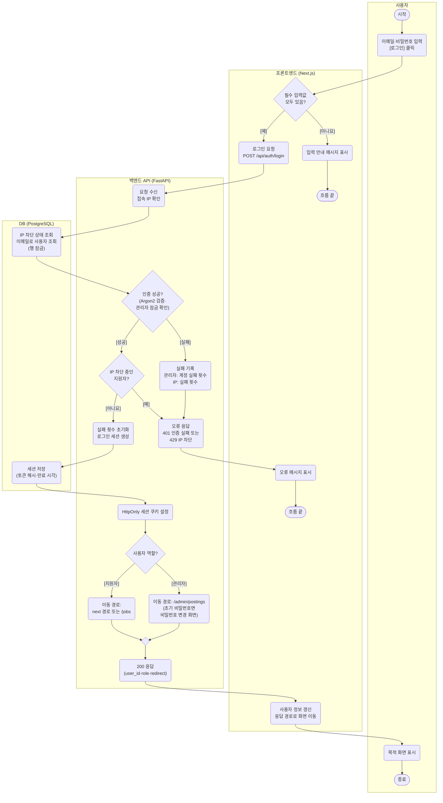
```mermaid
flowchart TB
    subgraph user["사용자"]
        s(["시작"])
        n1("이메일·비밀번호 입력<br/>[로그인] 클릭")
        n12("목적 화면 표시")
        e(["종료"])
    end
    subgraph front["프론트엔드 (Next.js)"]
        d1{"필수 입력값<br/>모두 있음?"}
        f1("입력 안내 메시지 표시")
        n2("로그인 요청<br/>POST /api/auth/login")
        ff1(["흐름 끝"])
        f4("오류 메시지 표시")
        ff2(["흐름 끝"])
        n11("사용자 정보 갱신<br/>응답 경로로 화면 이동")
    end
    subgraph api["백엔드 API (FastAPI)"]
        n3("요청 수신<br/>접속 IP 확인")
        d2{"인증 성공?<br/>(Argon2 검증·<br/>관리자 잠금 확인)"}
        f2("실패 기록<br/>관리자: 계정 실패 횟수<br/>IP: 실패 횟수")
        d3{"IP 차단 중인<br/>지원자?"}
        f3("오류 응답<br/>401 인증 실패 또는<br/>429 IP 차단")
        n5("실패 횟수 초기화<br/>로그인 세션 생성")
        n7("HttpOnly 세션 쿠키 설정")
        d4{"사용자 역할?"}
        n8("이동 경로: /admin/postings<br/>(초기 비밀번호면<br/>비밀번호 변경 화면)")
        n9("이동 경로:<br/>next 경로 또는 /jobs")
        m1{" "}
        n10("200 응답<br/>(user_id·role·redirect)")
    end
    subgraph db["DB (PostgreSQL)"]
        n4("IP 차단 상태 조회<br/>이메일로 사용자 조회<br/>(행 잠금)")
        n6("세션 저장<br/>(토큰 해시·만료 시각)")
    end
    s --> n1
    n1 --> d1
    d1 -->|"[아니요]"| f1
    f1 --> ff1
    d1 -->|"[예]"| n2
    n2 --> n3
    n3 --> n4
    n4 --> d2
    d2 -->|"[실패]"| f2
    f2 --> f3
    d2 -->|"[성공]"| d3
    d3 -->|"[예]"| f3
    f3 --> f4
    f4 --> ff2
    d3 -->|"[아니요]"| n5
    n5 --> n6
    n6 --> n7
    n7 --> d4
    d4 -->|"[관리자]"| n8
    d4 -->|"[지원자]"| n9
    n9 --> m1
    n8 --> m1
    m1 --> n10
    n10 --> n11
    n11 --> n12
    n12 --> e
```

## 02. 지원서 작성 (지원 → 동의 → 이력서 제출)

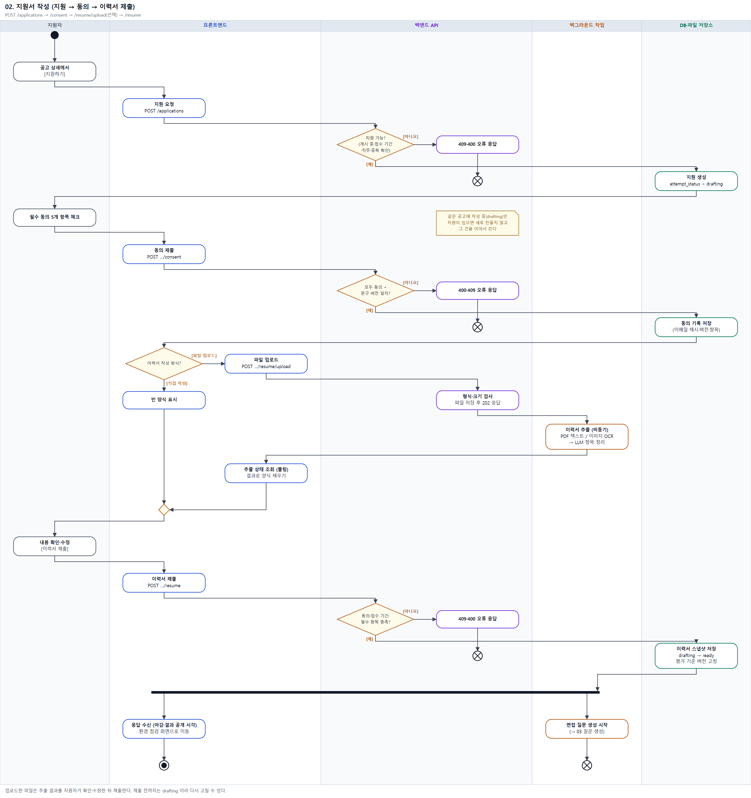

- 지원 요청은 게시 상태·접수 기간·직무·중복 지원을 검사한다. 작성 중인 지원이 있으면 그 건을 이어 쓴다.
- 필수 동의 5개와 동의 문구 버전이 맞아야 저장한다.
- 파일 업로드는 비동기로 추출하고, 지원자가 결과를 확인·수정한 뒤 제출한다.
- 제출하면 drafting → ready 가 되고, 평가 기준 버전이 고정되며, 질문 생성(03)이 시작된다.

Mermaid 원본

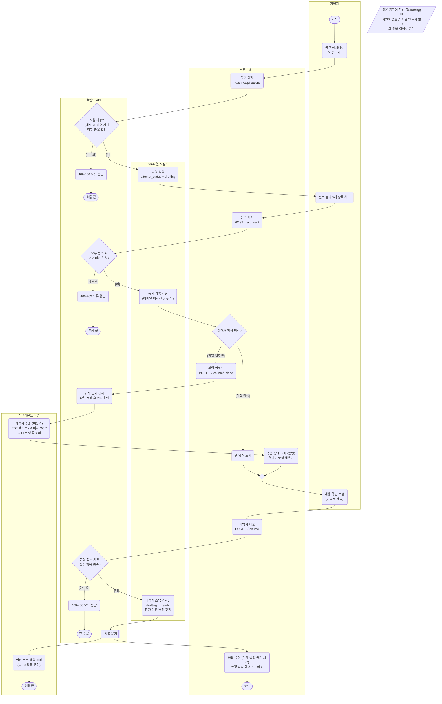
```mermaid
flowchart TB
    subgraph applicant["지원자"]
        s(["시작"])
        a1("공고 상세에서<br/>[지원하기]")
        a4("필수 동의 5개 항목 체크")
        a8("내용 확인·수정<br/>[이력서 제출]")
    end
    subgraph front["프론트엔드"]
        a2("지원 요청<br/>POST /applications")
        a5("동의 제출<br/>POST …/consent")
        d3{"이력서 작성 방식?"}
        u1("파일 업로드<br/>POST …/resume/upload")
        a7("빈 양식 표시")
        u4("추출 상태 조회 (폴링)<br/>결과로 양식 채우기")
        m1{" "}
        a9("이력서 제출<br/>POST …/resume")
        a11("응답 수신 (마감·결과 공개 시각)<br/>환경 점검 화면으로 이동")
        e(["종료"])
    end
    subgraph api["백엔드 API"]
        d1{"지원 가능?<br/>(게시 중·접수 기간<br/>·직무·중복 확인)"}
        x1("409·400 오류 응답")
        ff1(["흐름 끝"])
        d2{"모두 동의 +<br/>문구 버전 일치?"}
        x2("400·409 오류 응답")
        ff2(["흐름 끝"])
        u2("형식·크기 검사<br/>파일 저장 후 202 응답")
        d4{"동의·접수 기간·<br/>필수 항목 충족?"}
        x3("409·400 오류 응답")
        ff3(["흐름 끝"])
        b1[["병렬 분기"]]
    end
    subgraph worker["백그라운드 작업"]
        u3("이력서 추출 (비동기)<br/>PDF 텍스트 / 이미지 OCR<br/>→ LLM 항목 정리")
        a12("면접 질문 생성 시작<br/>(→ 03 질문 생성)")
        ff4(["흐름 끝"])
    end
    subgraph db["DB·파일 저장소"]
        a3("지원 생성<br/>attempt_status = drafting")
        a6("동의 기록 저장<br/>(이메일 해시·버전·항목)")
        a10("이력서 스냅샷 저장<br/>drafting → ready<br/>평가 기준 버전 고정")
    end
    s --> a1
    a1 --> a2
    a2 --> d1
    d1 -->|"[아니요]"| x1
    x1 --> ff1
    d1 -->|"[예]"| a3
    a3 --> a4
    a4 --> a5
    a5 --> d2
    d2 -->|"[아니요]"| x2
    x2 --> ff2
    d2 -->|"[예]"| a6
    a6 --> d3
    d3 -->|"[파일 업로드]"| u1
    u1 --> u2
    u2 --> u3
    u3 --> u4
    d3 -->|"[직접 작성]"| a7
    a7 --> m1
    u4 --> m1
    m1 --> a8
    a8 --> a9
    a9 --> d4
    d4 -->|"[아니요]"| x3
    x3 --> ff3
    d4 -->|"[예]"| a10
    a10 --> b1
    b1 --> a11
    a11 --> e
    b1 --> a12
    a12 --> ff4
    note0[/"같은 공고에 작성 중(drafting)인<br/>지원이 있으면 새로 만들지 않고<br/>그 건을 이어서 쓴다"/]
```

## 03. 면접 질문 생성 (질문 구성 그래프)

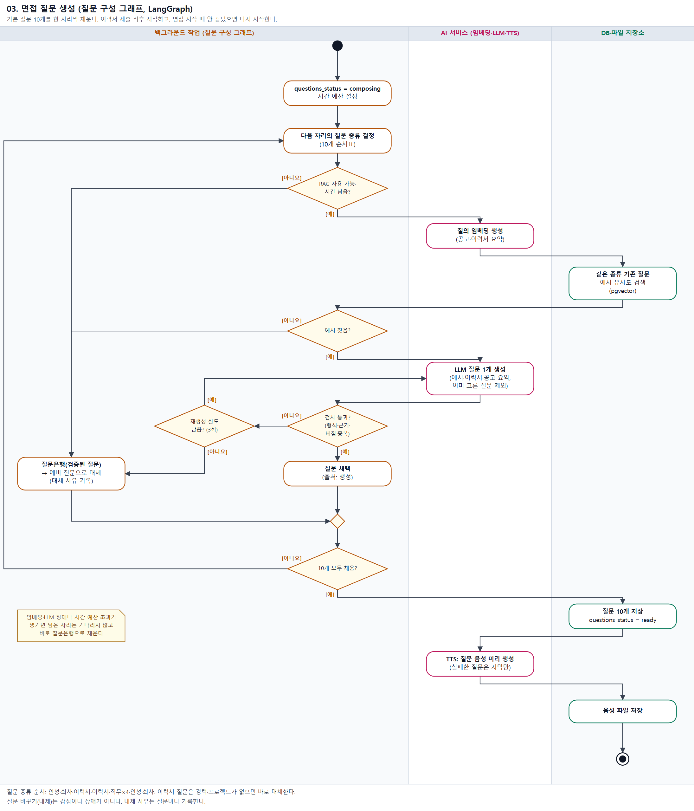

- 기본 질문 10개를 순서표대로 한 자리씩 채운다.
- 예시 질문을 pgvector 로 찾고, LLM 이 질문 1개를 만든다. 형식·근거·베낌·중복 검사를 통과해야 채택한다.
- 재생성 한도(3회)를 넘기거나 장애·시간 초과가 생기면 질문은행 질문으로 대신한다. 대체 사유를 기록한다.
- 10개가 모두 차면 ready 로 바꾸고 TTS 음성을 미리 만든다.

Mermaid 원본

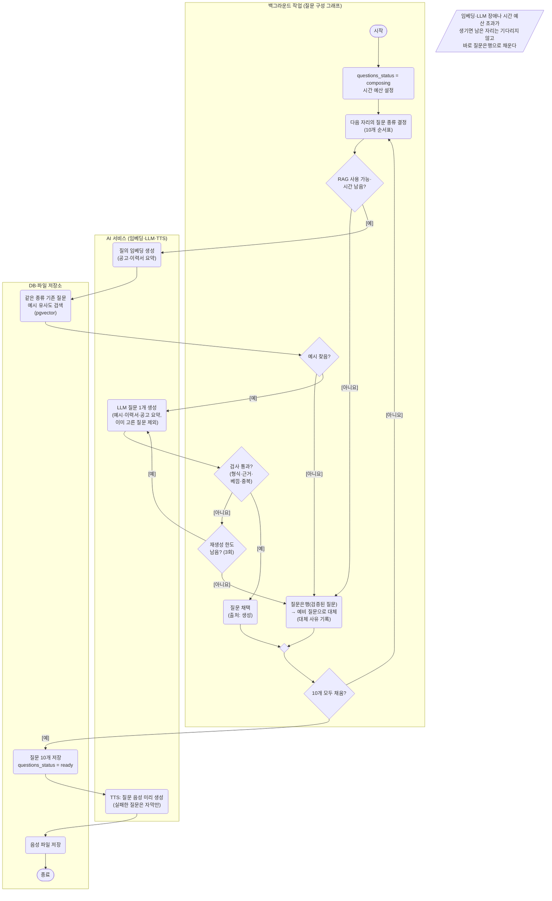
```mermaid
flowchart TB
    subgraph worker["백그라운드 작업 (질문 구성 그래프)"]
        s(["시작"])
        w1("questions_status = composing<br/>시간 예산 설정")
        w2("다음 자리의 질문 종류 결정<br/>(10개 순서표)")
        d1{"RAG 사용 가능·<br/>시간 남음?"}
        d2{"예시 찾음?"}
        d4{"재생성 한도<br/>남음? (3회)"}
        d3{"검사 통과?<br/>(형식·근거·<br/>베낌·중복)"}
        bk("질문은행(검증된 질문)<br/>→ 예비 질문으로 대체<br/>(대체 사유 기록)")
        ac("질문 채택<br/>(출처: 생성)")
        m1{" "}
        d5{"10개 모두 채움?"}
    end
    subgraph ai["AI 서비스 (임베딩·LLM·TTS)"]
        a1("질의 임베딩 생성<br/>(공고·이력서 요약)")
        a3("LLM 질문 1개 생성<br/>(예시·이력서·공고 요약,<br/>이미 고른 질문 제외)")
        a5("TTS: 질문 음성 미리 생성<br/>(실패한 질문은 자막만)")
    end
    subgraph db["DB·파일 저장소"]
        a2("같은 종류 기존 질문<br/>예시 유사도 검색<br/>(pgvector)")
        a4("질문 10개 저장<br/>questions_status = ready")
        a6("음성 파일 저장")
        e(["종료"])
    end
    s --> w1
    w1 --> w2
    w2 --> d1
    d1 -->|"[아니요]"| bk
    d1 -->|"[예]"| a1
    a1 --> a2
    a2 --> d2
    d2 -->|"[아니요]"| bk
    d2 -->|"[예]"| a3
    a3 --> d3
    d3 -->|"[아니요]"| d4
    d4 -->|"[예]"| a3
    d4 -->|"[아니요]"| bk
    d3 -->|"[예]"| ac
    ac --> m1
    bk --> m1
    m1 --> d5
    d5 -->|"[아니요]"| w2
    d5 -->|"[예]"| a4
    a4 --> a5
    a5 --> a6
    a6 --> e
    note0[/"임베딩·LLM 장애나 시간 예산 초과가<br/>생기면 남은 자리는 기다리지 않고<br/>바로 질문은행으로 채운다"/]
```

## 04. AI 면접 진행

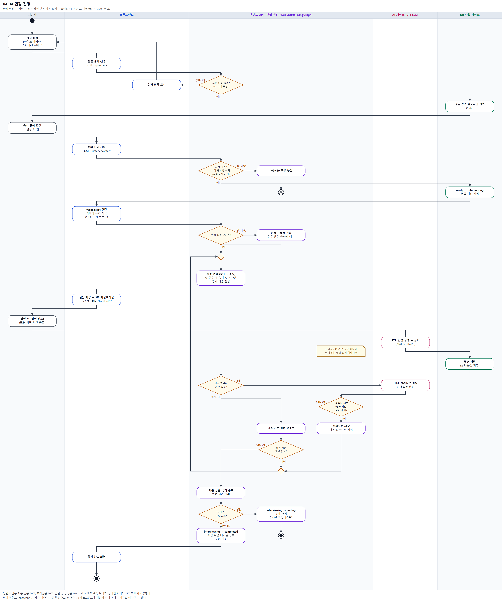

- 환경 점검 결과는 15분 동안 유효하다. 시작할 때 1회 응시·접수 기간·점검·동시 응시 자리(기본 2)를 확인한다.
- 질문 → 답변 녹음 → STT → 저장 → 꼬리질문 판단을 기본 질문 10개 동안 반복한다.
- 꼬리질문은 기본 질문 하나에 최대 1개, 면접 전체에 최대 4개다.
- 끝나면 코딩테스트 적용 공고는 coding(07), 아니면 completed 가 되고 채점(08)에 들어간다.

Mermaid 원본

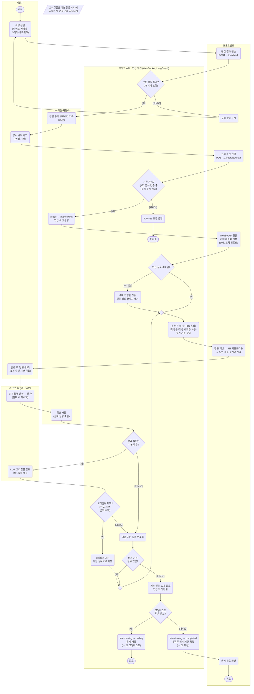
```mermaid
flowchart TB
    subgraph applicant["지원자"]
        s(["시작"])
        a1("환경 점검<br/>(마이크·카메라·<br/>스피커·네트워크)")
        a4("응시 규칙 확인<br/>[면접 시작]")
        a10("답변 후 [답변 완료]<br/>(또는 답변 시간 종료)")
    end
    subgraph front["프론트엔드"]
        a2("점검 결과 전송<br/>POST …/precheck")
        f1("실패 항목 표시")
        a5("전체 화면 전환<br/>POST …/interview/start")
        a7("WebSocket 연결<br/>카메라 녹화 시작<br/>(10초 조각 업로드)")
        a9("질문 재생 → 3초 카운트다운<br/>→ 답변 녹음·실시간 자막")
        f4("응시 완료 화면")
        e(["종료"])
    end
    subgraph api["백엔드 API · 면접 엔진 (WebSocket, LangGraph)"]
        d1{"모든 항목 통과?<br/>(AI 서버 포함)"}
        d2{"시작 가능?<br/>(1회 응시·접수 중<br/>·점검·동시 자리)"}
        x1("409·429 오류 응답")
        ff1(["흐름 끝"])
        d3{"면접 질문 준비됨?"}
        x2("준비 진행률 전송<br/>질문 생성 끝까지 대기")
        m1{" "}
        a8("질문 전송 (글·TTS 음성)<br/>첫 질문 때 응시 횟수 사용·<br/>평가 기준 잠금")
        d4{"방금 질문이<br/>기본 질문?"}
        d5{"꼬리질문 채택?<br/>(한도·시간·<br/>금지 주제)"}
        a15("다음 기본 질문 번호로")
        a14("꼬리질문 저장<br/>다음 질문으로 지정")
        d6{"남은 기본<br/>질문 있음?"}
        m2{" "}
        f2("기본 질문 10개 종료<br/>면접 자리 반환")
        d7{"코딩테스트<br/>적용 공고?"}
        c1("interviewing → coding<br/>문제 배정<br/>(→ 07 코딩테스트)")
        f3("interviewing → completed<br/>채점 작업 대기열 등록<br/>(→ 08 채점)")
        ef(["종료"])
    end
    subgraph ai["AI 서비스 (STT·LLM)"]
        a11("STT: 답변 음성 → 글자<br/>(실패 시 재시도)")
        a13("LLM: 꼬리질문 필요<br/>판단·질문 생성")
    end
    subgraph db["DB·파일 저장소"]
        a3("점검 통과 유효시간 기록<br/>(15분)")
        a6("ready → interviewing<br/>면접 세션 생성")
        a12("답변 저장<br/>(글자·음성 파일)")
    end
    s --> a1
    a1 --> a2
    a2 --> d1
    d1 -->|"[아니요]"| f1
    f1 --> a1
    d1 -->|"[예]"| a3
    a3 --> a4
    a4 --> a5
    a5 --> d2
    d2 -->|"[아니요]"| x1
    x1 --> ff1
    d2 -->|"[예]"| a6
    a6 --> a7
    a7 --> d3
    d3 -->|"[아니요]"| x2
    x2 --> m1
    d3 -->|"[예]"| m1
    m1 --> a8
    a8 --> a9
    a9 --> a10
    a10 --> a11
    a11 --> a12
    a12 --> d4
    d4 -->|"[예]"| a13
    a13 --> d5
    d5 -->|"[예]"| a14
    d5 -->|"[아니요]"| a15
    d4 -->|"[아니요]"| a15
    a15 --> d6
    d6 -->|"[예]"| m2
    a14 --> m2
    m2 --> m1
    d6 -->|"[아니요]"| f2
    f2 --> d7
    d7 -->|"[예]"| c1
    c1 --> ef
    d7 -->|"[아니요]"| f3
    f3 --> f4
    f4 --> e
    note0[/"꼬리질문은 기본 질문 하나에<br/>최대 1개, 면접 전체 최대 4개"/]
```

## 05. 화면 이탈 처리

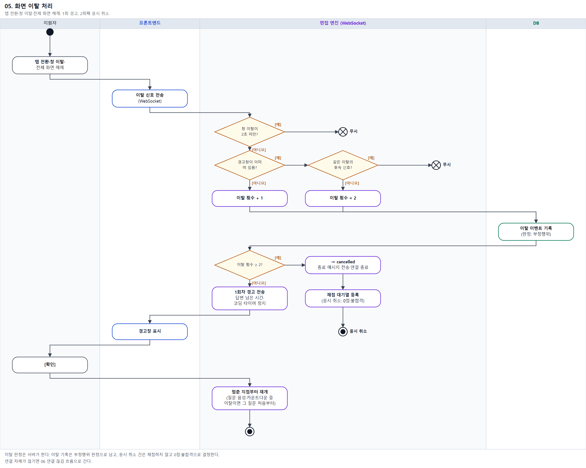

- 2초 미만 창 이탈은 무시한다. 같은 이탈에서 이어 온 신호는 한 번으로 센다.
- 1회차는 경고하고 타이머를 멈춘다. 2회차면 응시를 취소(cancelled)한다.
- 응시 취소 건은 채점하지 않고 0점·불합격으로 정한다.

Mermaid 원본

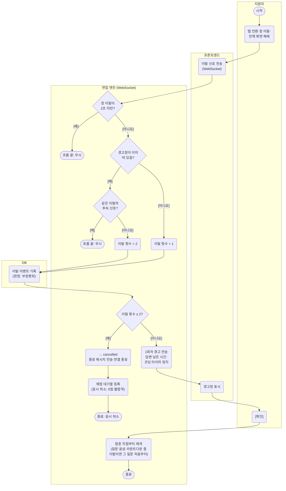
```mermaid
flowchart TB
    subgraph applicant["지원자"]
        s(["시작"])
        a1("탭 전환·창 이탈·<br/>전체 화면 해제")
        w3("[확인]")
    end
    subgraph front["프론트엔드"]
        a2("이탈 신호 전송<br/>(WebSocket)")
        w2("경고창 표시")
    end
    subgraph api["면접 엔진 (WebSocket)"]
        d1{"창 이탈이<br/>2초 미만?"}
        ff1(["흐름 끝: 무시"])
        d2{"경고창이 이미<br/>떠 있음?"}
        d3{"같은 이탈의<br/>후속 신호?"}
        ff2(["흐름 끝: 무시"])
        a3("이탈 횟수 + 1")
        a4("이탈 횟수 = 2")
        d4{"이탈 횟수 ≥ 2?"}
        c1("→ cancelled<br/>종료 메시지 전송·연결 종료")
        w1("1회차 경고 전송<br/>답변 남은 시간·<br/>코딩 타이머 정지")
        c2("채점 대기열 등록<br/>(응시 취소: 0점·불합격)")
        ec(["종료: 응시 취소"])
        w4("멈춘 지점부터 재개<br/>(질문 음성·카운트다운 중<br/>이탈이면 그 질문 처음부터)")
        e(["종료"])
    end
    subgraph db["DB"]
        a5("이탈 이벤트 기록<br/>(판정: 부정행위)")
    end
    s --> a1
    a1 --> a2
    a2 --> d1
    d1 -->|"[예]"| ff1
    d1 -->|"[아니요]"| d2
    d2 -->|"[예]"| d3
    d3 -->|"[예]"| ff2
    d3 -->|"[아니요]"| a4
    d2 -->|"[아니요]"| a3
    a3 --> a5
    a4 --> a5
    a5 --> d4
    d4 -->|"[예]"| c1
    c1 --> c2
    c2 --> ec
    d4 -->|"[아니요]"| w1
    w1 --> w2
    w2 --> w3
    w3 --> w4
    w4 --> e
```

## 06. 연결 끊김 처리와 이어가기

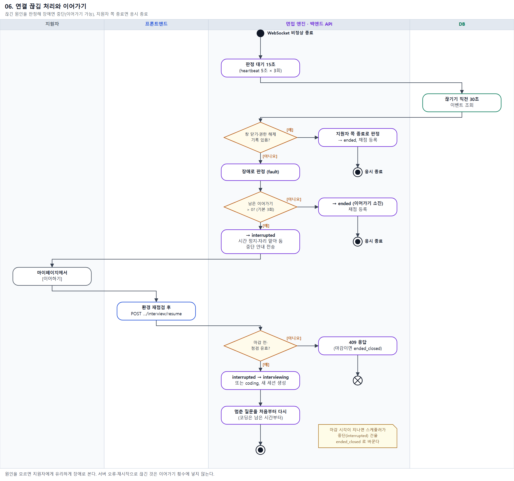

- heartbeat 5초 × 3회가 없으면 끊김으로 본다. 끊기기 직전 30초의 이벤트로 원인을 판정한다.
- 창 닫기·권한 해제가 있으면 지원자 쪽 종료(ended)로 본다. 원인을 모르면 장애로 본다.
- 장애면 interrupted 가 되고, 이어가기 횟수(기본 3회)가 남아 있는 동안 마이페이지에서 이어 할 수 있다.
- 마감이 지나면 스케줄러가 interrupted 건을 ended_closed 로 바꾼다.

Mermaid 원본

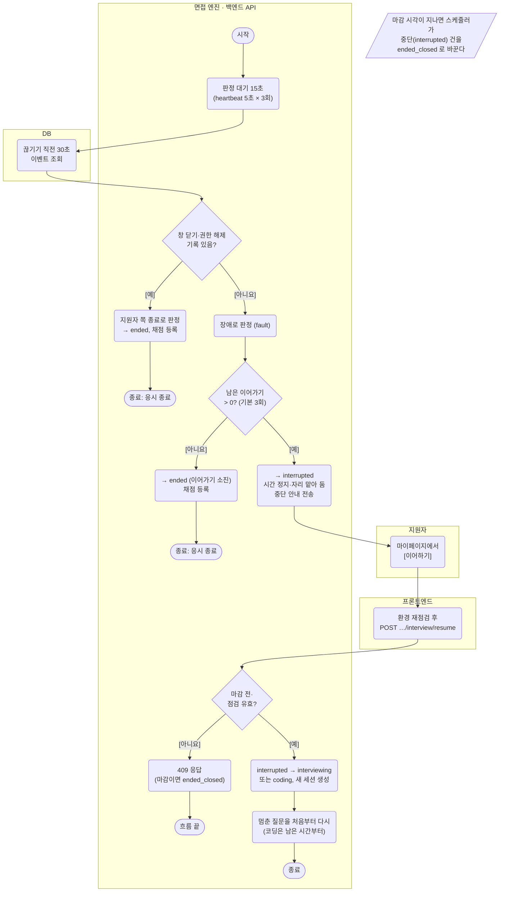
```mermaid
flowchart TB
    subgraph applicant["지원자"]
        a5("마이페이지에서<br/>[이어하기]")
    end
    subgraph front["프론트엔드"]
        a6("환경 재점검 후<br/>POST …/interview/resume")
    end
    subgraph api["면접 엔진 · 백엔드 API"]
        s(["시작"])
        a1("판정 대기 15초<br/>(heartbeat 5초 × 3회)")
        d1{"창 닫기·권한 해제<br/>기록 있음?"}
        n1("지원자 쪽 종료로 판정<br/>→ ended, 채점 등록")
        a3("장애로 판정 (fault)")
        en1(["종료: 응시 종료"])
        d2{"남은 이어가기<br/>> 0? (기본 3회)"}
        n2("→ ended (이어가기 소진)<br/>채점 등록")
        a4("→ interrupted<br/>시간 정지·자리 맡아 둠<br/>중단 안내 전송")
        en2(["종료: 응시 종료"])
        d3{"마감 전·<br/>점검 유효?"}
        n3("409 응답<br/>(마감이면 ended_closed)")
        a7("interrupted → interviewing<br/>또는 coding, 새 세션 생성")
        ff3(["흐름 끝"])
        a8("멈춘 질문을 처음부터 다시<br/>(코딩은 남은 시간부터)")
        e(["종료"])
    end
    subgraph db["DB"]
        a2("끊기기 직전 30초<br/>이벤트 조회")
    end
    s --> a1
    a1 --> a2
    a2 --> d1
    d1 -->|"[예]"| n1
    n1 --> en1
    d1 -->|"[아니요]"| a3
    a3 --> d2
    d2 -->|"[아니요]"| n2
    n2 --> en2
    d2 -->|"[예]"| a4
    a4 --> a5
    a5 --> a6
    a6 --> d3
    d3 -->|"[아니요]"| n3
    n3 --> ff3
    d3 -->|"[예]"| a7
    a7 --> a8
    a8 --> e
    note0[/"마감 시각이 지나면 스케줄러가<br/>중단(interrupted) 건을<br/>ended_closed 로 바꾼다"/]
```

## 07. 코딩테스트

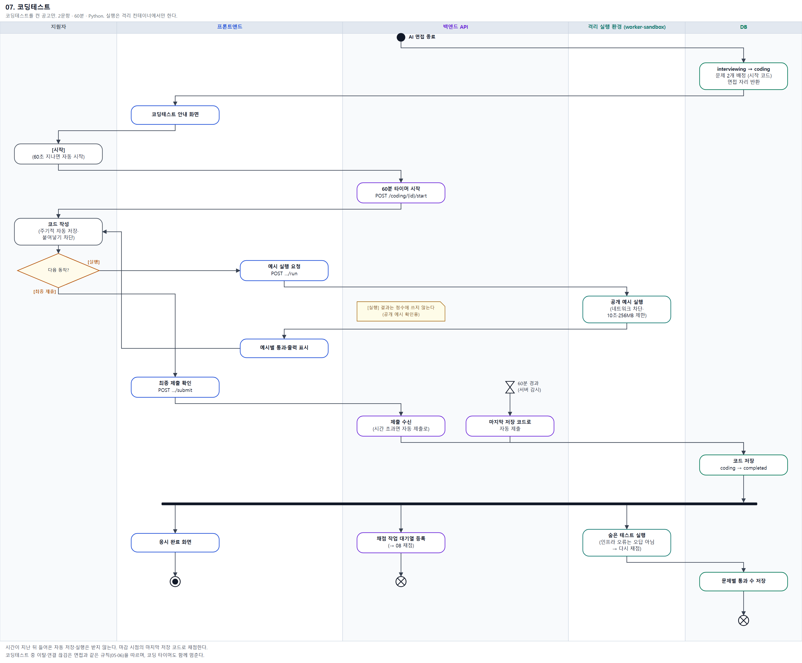

- 코딩테스트를 켠 공고만 해당한다. 2문항, 60분, Python 이다.
- [실행]은 공개 예시만 돌린다. 그 결과는 점수에 쓰지 않는다.
- 60분이 지나면 서버가 마지막 저장 코드로 자동 제출한다.
- 제출 뒤 숨은 테스트를 worker-sandbox 에서 돌려 문제별 통과 수를 저장한다.

Mermaid 원본

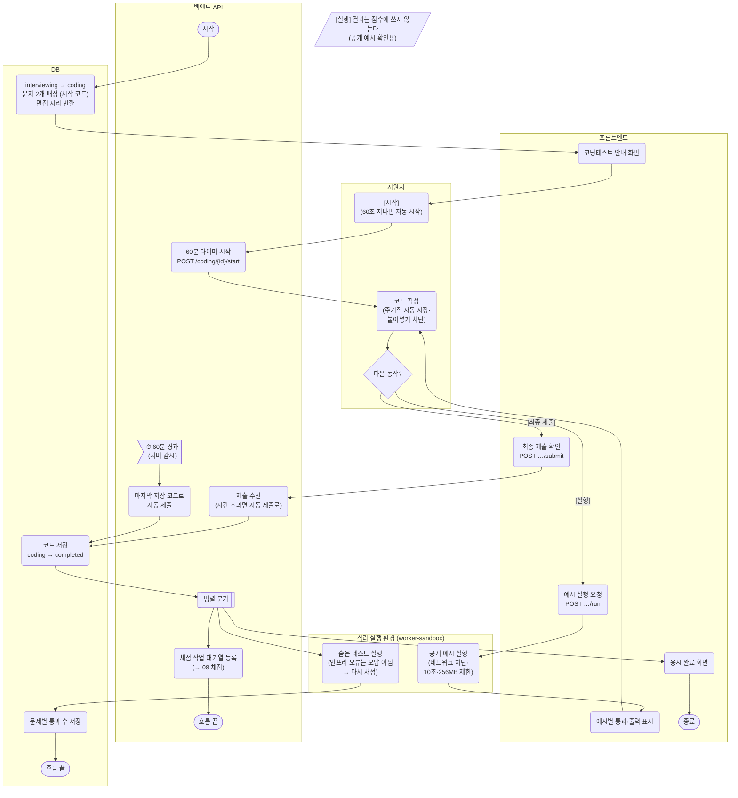
```mermaid
flowchart TB
    subgraph applicant["지원자"]
        b3("[시작]<br/>(60초 지나면 자동 시작)")
        b5("코드 작성<br/>(주기적 자동 저장·<br/>붙여넣기 차단)")
        d1{"다음 동작?"}
    end
    subgraph front["프론트엔드"]
        b2("코딩테스트 안내 화면")
        r1("예시 실행 요청<br/>POST …/run")
        r3("예시별 통과·출력 표시")
        p1("최종 제출 확인<br/>POST …/submit")
        q1("응시 완료 화면")
        e(["종료"])
    end
    subgraph api["백엔드 API"]
        s(["시작"])
        b4("60분 타이머 시작<br/>POST /coding/{id}/start")
        t1>"⏱ 60분 경과<br/>(서버 감시)"]
        p2("제출 수신<br/>(시간 초과면 자동 제출로)")
        p3("마지막 저장 코드로<br/>자동 제출")
        b6[["병렬 분기"]]
        q2("채점 작업 대기열 등록<br/>(→ 08 채점)")
        ff1(["흐름 끝"])
    end
    subgraph sandbox["격리 실행 환경 (worker-sandbox)"]
        r2("공개 예시 실행<br/>(네트워크 차단·<br/>10초·256MB 제한)")
        q3("숨은 테스트 실행<br/>(인프라 오류는 오답 아님<br/>→ 다시 채점)")
    end
    subgraph db["DB"]
        b1("interviewing → coding<br/>문제 2개 배정 (시작 코드)<br/>면접 자리 반환")
        p4("코드 저장<br/>coding → completed")
        q4("문제별 통과 수 저장")
        ff2(["흐름 끝"])
    end
    s --> b1
    b1 --> b2
    b2 --> b3
    b3 --> b4
    b4 --> b5
    b5 --> d1
    d1 -->|"[실행]"| r1
    r1 --> r2
    r2 --> r3
    r3 --> b5
    d1 -->|"[최종 제출]"| p1
    p1 --> p2
    t1 --> p3
    p2 --> p4
    p3 --> p4
    p4 --> b6
    b6 --> q1
    q1 --> e
    b6 --> q2
    q2 --> ff1
    b6 --> q3
    q3 --> q4
    q4 --> ff2
    note0[/"[실행] 결과는 점수에 쓰지 않는다<br/>(공개 예시 확인용)"/]
```

## 08. 채점과 결과 공개

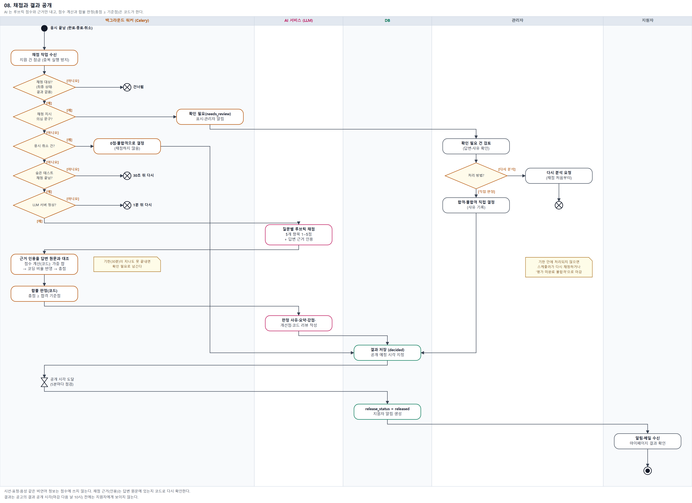

- AI 는 질문별 루브릭 점수(5개 항목, 1~5점)와 답변 근거만 낸다. 점수 합산과 합불 판정(총점 ≥ 기준점)은 코드가 한다.
- 채점 지시로 의심되는 문구가 있으면 확인 필요(needs_review)로 넘기고 관리자가 처리한다.
- 숨은 테스트가 덜 끝났으면 30초 뒤, LLM 서버가 내려가 있으면 1분 뒤 다시 시도한다.
- 결과는 마감 다음 날 10시에 공개(released)되고 지원자에게 알림이 간다.

Mermaid 원본

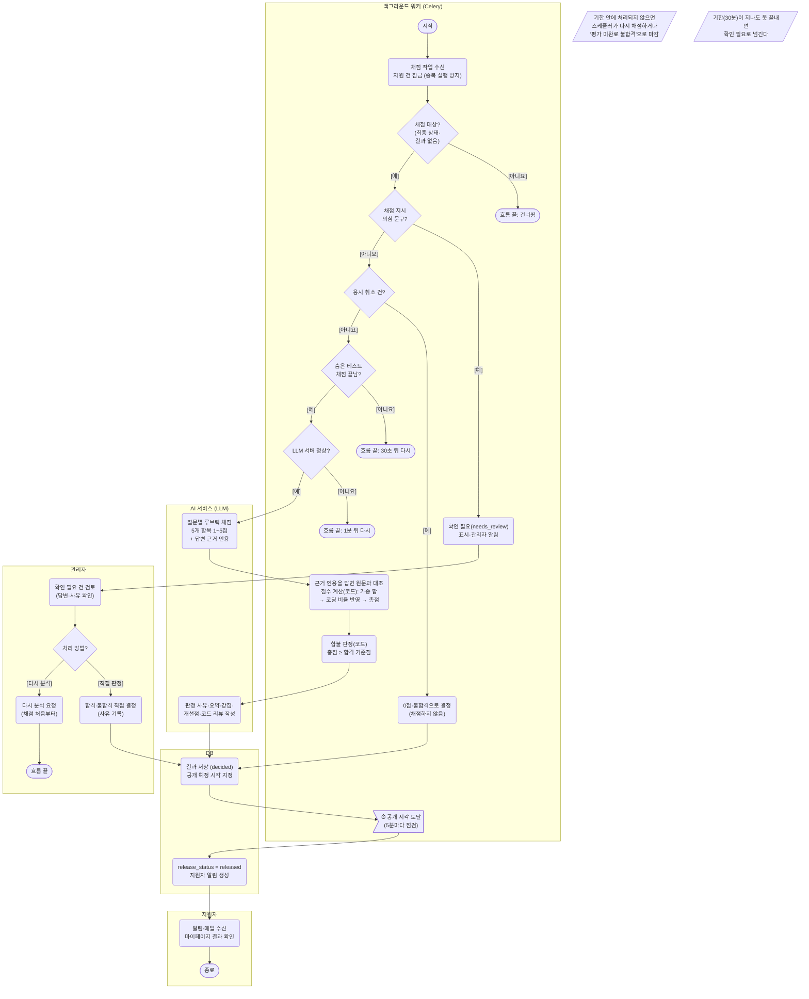
```mermaid
flowchart TB
    subgraph worker["백그라운드 워커 (Celery)"]
        s(["시작"])
        g1("채점 작업 수신<br/>지원 건 잠금 (중복 실행 방지)")
        d1{"채점 대상?<br/>(최종 상태·<br/>결과 없음)"}
        ff1(["흐름 끝: 건너뜀"])
        d2{"채점 지시<br/>의심 문구?"}
        nr("확인 필요(needs_review)<br/>표시·관리자 알림")
        d3{"응시 취소 건?"}
        c1("0점·불합격으로 결정<br/>(채점하지 않음)")
        d4{"숨은 테스트<br/>채점 끝남?"}
        ff2(["흐름 끝: 30초 뒤 다시"])
        d5{"LLM 서버 정상?"}
        ff3(["흐름 끝: 1분 뒤 다시"])
        w2("근거 인용을 답변 원문과 대조<br/>점수 계산(코드): 가중 합<br/>→ 코딩 비율 반영 → 총점")
        w3("합불 판정(코드)<br/>총점 ≥ 합격 기준점")
        t1>"⏱ 공개 시각 도달<br/>(5분마다 점검)"]
    end
    subgraph ai["AI 서비스 (LLM)"]
        ai1("질문별 루브릭 채점<br/>5개 항목 1~5점<br/>+ 답변 근거 인용")
        ai2("판정 사유·요약·강점·<br/>개선점·코드 리뷰 작성")
    end
    subgraph db["DB"]
        r1("결과 저장 (decided)<br/>공개 예정 시각 지정")
        r2("release_status = released<br/>지원자 알림 생성")
    end
    subgraph admin["관리자"]
        m1("확인 필요 건 검토<br/>(답변·사유 확인)")
        m2{"처리 방법?"}
        m4("다시 분석 요청<br/>(채점 처음부터)")
        m3("합격·불합격 직접 결정<br/>(사유 기록)")
        ff4(["흐름 끝"])
    end
    subgraph applicant["지원자"]
        p1("알림·메일 수신<br/>마이페이지 결과 확인")
        e(["종료"])
    end
    s --> g1
    g1 --> d1
    d1 -->|"[아니요]"| ff1
    d1 -->|"[예]"| d2
    d2 -->|"[예]"| nr
    nr --> m1
    d2 -->|"[아니요]"| d3
    d3 -->|"[예]"| c1
    c1 --> r1
    d3 -->|"[아니요]"| d4
    d4 -->|"[아니요]"| ff2
    d4 -->|"[예]"| d5
    d5 -->|"[아니요]"| ff3
    d5 -->|"[예]"| ai1
    ai1 --> w2
    w2 --> w3
    w3 --> ai2
    ai2 --> r1
    m1 --> m2
    m2 -->|"[직접 판정]"| m3
    m2 -->|"[다시 분석]"| m4
    m4 --> ff4
    m3 --> r1
    r1 --> t1
    t1 --> r2
    r2 --> p1
    p1 --> e
    note0[/"기한 안에 처리되지 않으면<br/>스케줄러가 다시 채점하거나<br/>'평가 미완료 불합격'으로 마감"/]
    note1[/"기한(30분)이 지나도 못 끝내면<br/>확인 필요로 넘긴다"/]
```

## 09. 관리자 공고 작성·게시

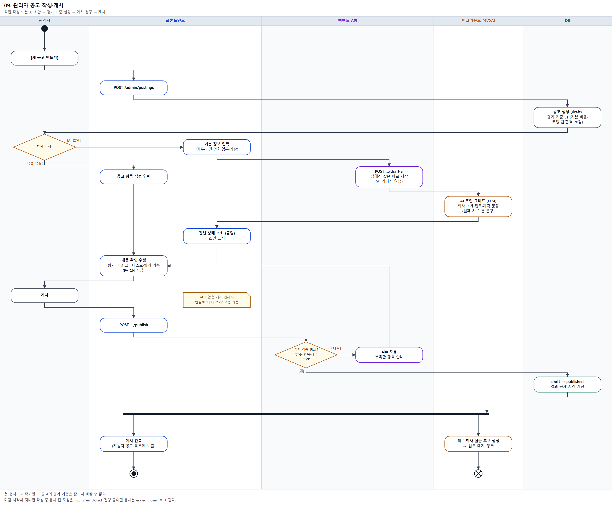

- 새 공고는 draft 와 평가 기준 v1(코딩 끔, 코딩 비율 30, 합격 70점)로 만들어진다.
- 직접 작성하거나 AI 초안을 받는다. AI 는 회사 소개·업무·자격 문장만 쓰고, 정해진 값은 그대로 저장한다.
- 게시할 때 필수 항목·직무·기간을 검사하고, 통과하면 published 가 되며 결과 공개 시각이 정해진다.
- 게시와 동시에 직무·회사 질문 후보가 '검토 대기'로 생성된다.

Mermaid 원본

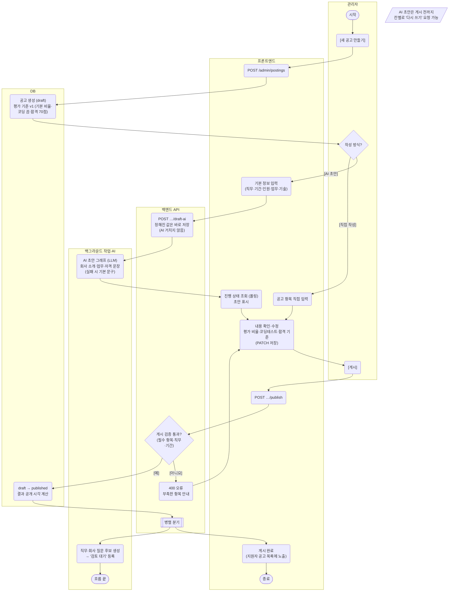
```mermaid
flowchart TB
    subgraph admin["관리자"]
        s(["시작"])
        p1("[새 공고 만들기]")
        d1{"작성 방식?"}
        p6("[게시]")
    end
    subgraph front["프론트엔드"]
        p2("POST /admin/postings")
        q0("기본 정보 입력<br/>(직무·기간·인원·업무·기술)")
        p4("공고 항목 직접 입력")
        q3("진행 상태 조회 (폴링)<br/>초안 표시")
        p5("내용 확인·수정<br/>평가 비율·코딩테스트·합격 기준<br/>(PATCH 저장)")
        p7("POST …/publish")
        p9("게시 완료<br/>(지원자 공고 목록에 노출)")
        e(["종료"])
    end
    subgraph api["백엔드 API"]
        q1("POST …/draft-ai<br/>정해진 값은 바로 저장<br/>(AI 거치지 않음)")
        d2{"게시 검증 통과?<br/>(필수 항목·직무<br/>·기간)"}
        x1("400 오류<br/>부족한 항목 안내")
        b1[["병렬 분기"]]
    end
    subgraph worker["백그라운드 작업·AI"]
        q2("AI 초안 그래프 (LLM)<br/>회사 소개·업무·자격 문장<br/>(실패 시 기본 문구)")
        p10("직무·회사 질문 후보 생성<br/>→ '검토 대기' 등록")
        ff1(["흐름 끝"])
    end
    subgraph db["DB"]
        p3("공고 생성 (draft)<br/>평가 기준 v1 (기본 비율·<br/>코딩 끔·합격 70점)")
        p8("draft → published<br/>결과 공개 시각 계산")
    end
    s --> p1
    p1 --> p2
    p2 --> p3
    p3 --> d1
    d1 -->|"[AI 초안]"| q0
    q0 --> q1
    q1 --> q2
    q2 --> q3
    d1 -->|"[직접 작성]"| p4
    p4 --> p5
    q3 --> p5
    p5 --> p6
    p6 --> p7
    p7 --> d2
    d2 -->|"[아니요]"| x1
    x1 --> p5
    d2 -->|"[예]"| p8
    p8 --> b1
    b1 --> p9
    p9 --> e
    b1 --> p10
    p10 --> ff1
    note0[/"AI 초안은 게시 전까지<br/>칸별로 '다시 쓰기' 요청 가능"/]
```

